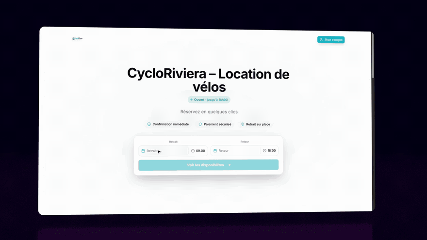
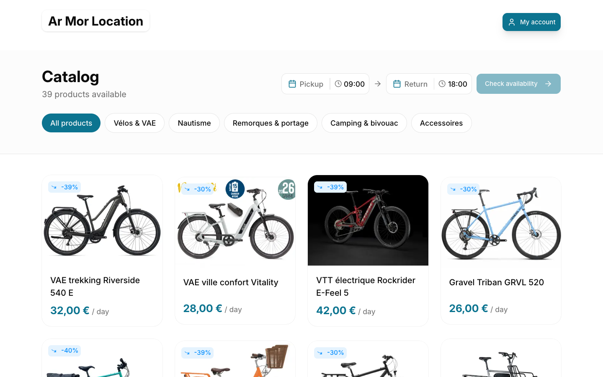
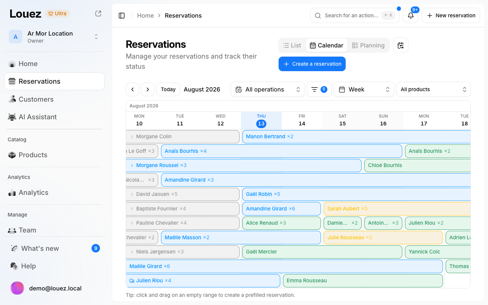
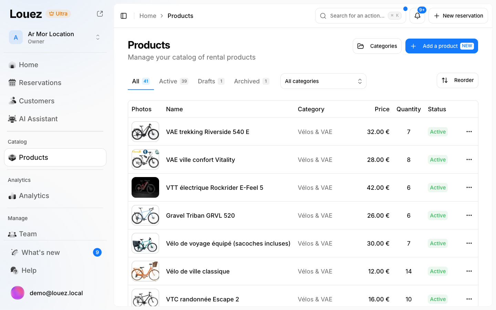

<div align="right">

🌐 **Language**: [Français](README.fr.md) | **English**

</div>

<div align="center">


# Louez

### The Open-Source Equipment Rental Platform

**Stop paying for expensive SaaS. Own your rental business software.**

[](https://hub.docker.com/r/synapsr/louez)
[](https://github.com/Synapsr/Louez)
[](LICENSE)

[☁️ Cloud](https://louez.io) • [🚀 Self-Host](#-self-host-in-one-command) • [✨ Features](#-features) • [📋 Changelog](CHANGELOG.md)

</div>

---

## 🎬 See it in action

<div align="center">



_A customer picks their dates on your storefront — the request lands in your dashboard_

| Storefront catalog | Reservation calendar | Inventory |
|:-:|:-:|:-:|
| [](.github/assets/storefront.png) | [](.github/assets/dashboard-reservations.png) | [](.github/assets/dashboard-products.png) |

[▶️ Watch the full demo](demo.mp4) • [☁️ Try the hosted version](https://louez.io)

**⭐ If Louez can replace a subscription for you, star the repo** — it is how the next rental business finds it.

</div>

---

## 💡 Why Louez?

Whether you rent cameras, tools, party equipment, or vehicles — **Louez** gives you everything you need to run your rental business professionally.

> 🇫🇷 _"Louez" means "rent" in French — because great software deserves a name that speaks to its purpose._

|                   💸 **No Monthly Fees**                   |               🎨 **Beautiful Storefronts**                |            🔒 **Own Your Data**             |
| :--------------------------------------------------------: | :-------------------------------------------------------: | :-----------------------------------------: |
| Self-host for free. No subscriptions, no per-booking fees. | Every store gets a stunning, customizable online catalog. | Your server, your database, your customers. |

|             ⚡ **Deploy in Minutes**             |                 🌍 **Multi-language**                 |        📱 **Mobile Ready**         |
| :----------------------------------------------: | :---------------------------------------------------: | :--------------------------------: |
| One command and you're live — database included. | 8 languages built-in: EN, FR, DE, ES, IT, NL, PL, PT. | Responsive design for all devices. |

---

## ☁️ Cloud or Self-Hosted — You Choose

<table>
<tr>
<td align="center" width="50%">

### ☁️ Louez Cloud

**Don't want to manage servers?**

We handle hosting, updates, backups, emails, payments & the AI assistant for you.

**[Get started free → louez.io](https://louez.io)**

</td>
<td align="center" width="50%">

### 🖥️ Self-Hosted

**Want full control?**

Deploy on your own infrastructure. 100% free, forever.

**[Deploy now ↓](#-self-host-in-one-command)**

</td>
</tr>
</table>

---

## 🚀 Self-Host in One Command

```bash
git clone https://github.com/Synapsr/Louez.git
cd Louez
docker compose up -d
```

**That's it.** Open [http://localhost:3000](http://localhost:3000), create your account, and set up your store. Your storefront goes live at the root of the site; your dashboard lives at `/dashboard`.

> Worked on the first try? [Leave a ⭐](https://github.com/Synapsr/Louez) — it costs you a click and it is how the next rental business finds Louez instead of a €99/month subscription.

The bundled [docker-compose.yml](docker-compose.yml) is a complete, self-contained deployment:

- 🗄️ **Database included** — MySQL runs alongside the app, and the schema installs itself on first boot
- 🖼️ **Image storage included** — a private MinIO bucket, served through the app (no extra ports, no CDN setup)
- ✂️ **Background removal included** — a private worker built on MIT-licensed `rembg` enables one-click product isolation without an API key
- 🔑 **No secrets to generate** — an auth secret is created and persisted automatically
- ✉️ **No email server required** — sign in with a password; plug in any SMTP provider later to enable outgoing email
- 🏪 **Single-store mode** — the instance hosts your store, not a SaaS

The lightweight image worker uses roughly 450 MB of RAM while loaded. Plan for
at least 2 GB for the complete stack; 4 GB leaves comfortable production
headroom.

### Using your own domain

Point a reverse proxy (Caddy, Nginx, Traefik) with TLS at port 3000 and set two variables in a `.env` file next to the compose file:

```bash
NEXT_PUBLIC_APP_URL="https://rentals.example.com"
AUTH_URL="https://rentals.example.com"
```

### One-click deploy

Prefer a hosting panel to a terminal? Louez launches in one click — app, database and image storage together:

[](https://render.com/deploy?repo=https://github.com/Synapsr/Louez)
[](https://heroku.com/deploy?template=https://github.com/Synapsr/Louez)

Or import the bundled Compose stack in **EasyPanel, Dokploy, Coolify, CapRover or Portainer** — it deploys the web app, MySQL, MinIO and the private background-removal worker together. The published image `synapsr/louez` still runs independently in single-store mode, but image isolation requires its companion `synapsr/louez-background-removal` service. See [.env.example](.env.example) for the full configuration surface (S3 storage, SMTP, Stripe, AI, and more).

### Multi-tenant deployments

Louez can also run as a multi-store platform (the way [louez.io](https://louez.io) does): one dashboard subdomain, one storefront per store subdomain. Set `LOUEZ_MODE=platform` plus the domain variables documented in [.env.example](.env.example).

> ⬆️ **Upgrading an existing multi-store self-host?** Add `LOUEZ_MODE=platform` to your environment to keep subdomain routing — newer images default to single-store mode.

---

## ✨ Features

### 📊 Powerful Dashboard

Everything you need to manage your rental business in one place.

|     | Feature          | What it does                                                             |
| :-: | ---------------- | ------------------------------------------------------------------------ |
| 📦  | **Products**     | Manage inventory with images, flexible pricing tiers, and stock tracking |
| 📅  | **Reservations** | Handle bookings, track status, manage pickups & returns                  |
| 🗓️  | **Calendar**     | Visual week/month view of all your reservations                          |
| 👥  | **Customers**    | Complete customer database with history                                  |
| 📈  | **Statistics**   | Revenue charts, top products, occupancy insights                         |
| 📄  | **Contracts**    | Auto-generated PDF contracts                                             |
| ✉️  | **Emails**       | Automated confirmations, reminders & notifications                       |
| 👨‍👩‍👧‍👦  | **Team**         | Invite staff with role-based permissions                                 |

### 🛍️ Stunning Storefronts

Each rental business gets its own branded online store.

- 🎨 **Custom Branding** — Logo, colors, light/dark theme
- 📱 **Product Catalog** — Filterable grid with real-time availability
- 🛒 **Shopping Cart** — Date selection, quantities, dynamic pricing
- ✅ **Checkout** — Customer form, order summary, terms acceptance
- 👤 **Customer Portal** — Passwordless login, reservation tracking
- 📜 **Legal Pages** — Editable terms & conditions

### 🤖 AI Assistant

Louez ships a full AI layer that works for your store around the clock.

- 💬 **Storefront AI advisor** — a chat assistant on your storefront that recommends the right gear from your live catalog, checks real availability for the customer's dates, answers questions about your hours and policies, and guides visitors all the way to booking. You brief it in plain language, like a new employee.
- 📞 **AI voice receptionist** — an assistant that answers your store's phone line: it handles questions about products, prices and availability, takes booking _requests_ you review from the dashboard, sends the caller an SMS recap, and can hand over to a human. Pick its voice (with audio preview), its language (8 supported), and whether it answers every call or only outside opening hours. You can even get a phone number without leaving the dashboard.
- 🎛️ **One control panel** — configure both assistants, replay conversations and calls, and see which chats turned into reservations.

The AI assistant is available out of the box on **[Louez Cloud](https://louez.io)**. Self-hosters can connect their own AI and telephony providers — the configuration lives in [.env.example](.env.example).

---

## 🛠️ Development Setup

Want to customize or contribute? Here's how to run locally:

```bash
# Clone the repo
git clone https://github.com/Synapsr/Louez.git
cd Louez

# Install dependencies
pnpm install

# Configure environment (creates .env.local at root and in apps/web)
cp .env.example .env.local
cp apps/web/.env.example apps/web/.env.local

# Setup database
pnpm db:push

# Start dev server
pnpm dev
```

Open [http://localhost:3000](http://localhost:3000) 🎉

---

## 🏗️ Tech Stack

Built with modern, battle-tested technologies:

|     | Technology         | Purpose                                        |
| :-: | ------------------ | ---------------------------------------------- |
| ⚡  | **Next.js 16**     | React framework with App Router                |
| 📘  | **TypeScript**     | Type-safe development                          |
| 🎨  | **Tailwind CSS 4** | Utility-first styling                          |
| 🧩  | **Base UI**        | Accessible UI primitives                       |
| 🗄️  | **Drizzle ORM**    | Type-safe database queries (MySQL)             |
| 🔐  | **better-auth**    | Authentication (password, email codes, Google) |
| ✉️  | **React Email**    | Beautiful email templates                      |
| 📄  | **React PDF**      | Contract generation                            |
| 🌍  | **next-intl**      | Internationalization                           |

---

## 📖 Documentation

- [Adding integrations guide](docs/integrations/adding-an-integration.md)

<details>
<summary><strong>📋 Environment Variables</strong></summary>

The bundled docker-compose deployment configures all of the required variables for you. For custom deployments:

| Variable                                | Required | Description                                                               |
| --------------------------------------- | :------: | ------------------------------------------------------------------------- |
| `DATABASE_URL`                          |    ✅    | MySQL connection string                                                   |
| `NEXT_PUBLIC_APP_URL`                   |    ✅    | Public URL of your app                                                    |
| `NEXT_PUBLIC_APP_DOMAIN`                |    ✅    | Public domain of your app                                                 |
| `AUTH_URL`                              |    ✅    | URL users sign in from (usually the app URL)                              |
| `AUTH_SECRET`                           |          | Random secret (auto-generated by the compose deployment)                  |
| `S3_*`                                  |          | S3-compatible storage for images (bundled MinIO in compose)               |
| `LOUEZ_MODE`                            |          | `standalone` (default) or `platform` (multi-tenant routing)               |
| `BACKGROUND_REMOVAL_API_TOKEN`          |          | Shared Bearer token when the image worker is publicly reachable           |
| `AI_IMAGE_OPENAI_API_KEY`               |          | Enables optional GPT Image enhancement; local background removal is bundled |
| `SMTP_*`                                |          | Outgoing email — optional; email features disable gracefully              |
| `AUTH_GOOGLE_ID` / `AUTH_GOOGLE_SECRET` |          | Google sign-in — optional                                                 |
| `STRIPE_*`                              |          | Online payments — optional; storefronts fall back to booking requests     |

Advanced integrations (AI providers, telephony, SMS, analytics, calendar sync…) are documented in [.env.example](.env.example).

</details>

<details>
<summary><strong>📁 Project Structure</strong></summary>

```
louez/
├── apps/
│   ├── web/               # Next.js app (dashboard + storefronts + API)
│   │   ├── app/           # App Router routes
│   │   ├── components/    # Dashboard & storefront components
│   │   ├── lib/           # Business logic, email, PDF, AI
│   │   └── messages/      # i18n translations (8 languages)
│   └── voice-relay/       # Optional streaming voice bridge (AI receptionist)
├── packages/
│   ├── api/               # oRPC routers & services
│   ├── auth/              # better-auth configuration
│   ├── db/                # Drizzle schema & migrations (MySQL)
│   ├── email/             # Email transport & templates
│   ├── ui/                # Shared UI components
│   └── ...                # types, utils, validations, pdf, config
└── docker/                # Production Dockerfiles & entrypoint
```

</details>

<details>
<summary><strong>🔧 Available Scripts</strong></summary>

```bash
pnpm dev          # Start development server
pnpm build        # Build for production
pnpm start        # Start production server
pnpm lint         # Run the linter
pnpm format       # Format the codebase
pnpm type-check   # Type-check the monorepo
pnpm db:push      # Sync schema to database
pnpm db:studio    # Open Drizzle Studio GUI
pnpm db:generate  # Generate migrations
pnpm db:migrate   # Run migrations
```

</details>

---

## 🤝 Contributing

We love contributions! Here's how you can help:

- 🐛 **Report bugs** — Found an issue? Let us know
- 💡 **Suggest features** — Have an idea? Open a discussion
- 🔧 **Submit PRs** — Code contributions welcome
- 📖 **Improve docs** — Help others get started

### Development Workflow

```bash
# Fork & clone
git clone https://github.com/YOUR_USERNAME/louez.git

# Create branch
git checkout -b feature/amazing-feature

# Make changes & commit
git commit -m 'Add amazing feature'

# Push & open PR
git push origin feature/amazing-feature
```

---

## 🔒 Security

Found a vulnerability? Please report it responsibly.

📧 **Email**: [security@louez.io](mailto:security@louez.io)

See [SECURITY.md](SECURITY.md) for our full security policy.

---

## 📄 License

**GNU AGPLv3** — see [LICENSE](LICENSE). Louez is free and open source.

✅ Free to use, self-host, and modify — forever
✅ Free for **commercial use** — run your rental business on it
✅ Contributions welcome
↩️ If you modify Louez and offer it to others over a network, share your changes back under the AGPL

> **Trademark**: "Louez" and the Louez logo are trademarks of Synapsr. The AGPL covers the code, not the brand.

### Third-party assets

The dashboard uses icons from [Nucleo](https://nucleoapp.com) © Nucleo — see [NOTICE](NOTICE). They are **not** covered by this repository's license and require a valid [Nucleo license](https://nucleoapp.com/license). The icon sources are not vendored here: they come from the official [`nucleo-glass`](https://www.npmjs.com/package/nucleo-glass) and [`nucleo-ui-outline-18`](https://www.npmjs.com/package/nucleo-ui-outline-18) npm packages at install time. Don't extract or reuse these icons outside the app. Contributors must keep the total below 100, with usage centralized in `packages/ui/src/icons/`; self-hosters remain responsible for ensuring their use is licensed.

The background-removal image includes MIT-licensed [`rembg`](https://github.com/danielgatis/rembg) and the Apache-2.0 [`isnet-general-use` model from DIS/IS-Net](https://github.com/xuebinqin/DIS). Their attribution is recorded in [NOTICE](NOTICE).

---

<div align="center">

### ⭐ Star us on GitHub!

If Louez helps your business, show some love with a star.

[](https://github.com/Synapsr/Louez)

---

**Built with ❤️ by [Synapsr](https://github.com/synapsr)**

[Report Bug](https://github.com/Synapsr/Louez/issues) • [Request Feature](https://github.com/Synapsr/Louez/discussions) • [Documentation](#-documentation)

</div>
